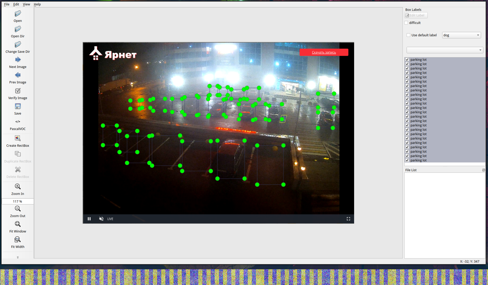

# Пример построения предсказания

1. Выберите парковку.
2. Вручную разметьте её парковочные места  с помощью LabelImg, используя лейбл parking lot, и сохраните в формате .json (CreateML)

3. `python3 extra_scripts/show_predict.py example/Парковка_РИО_2022_09_07.json example/Парковка_РИО_2022_09_07.png`, чтобы получить занятость парковки на картинке.
